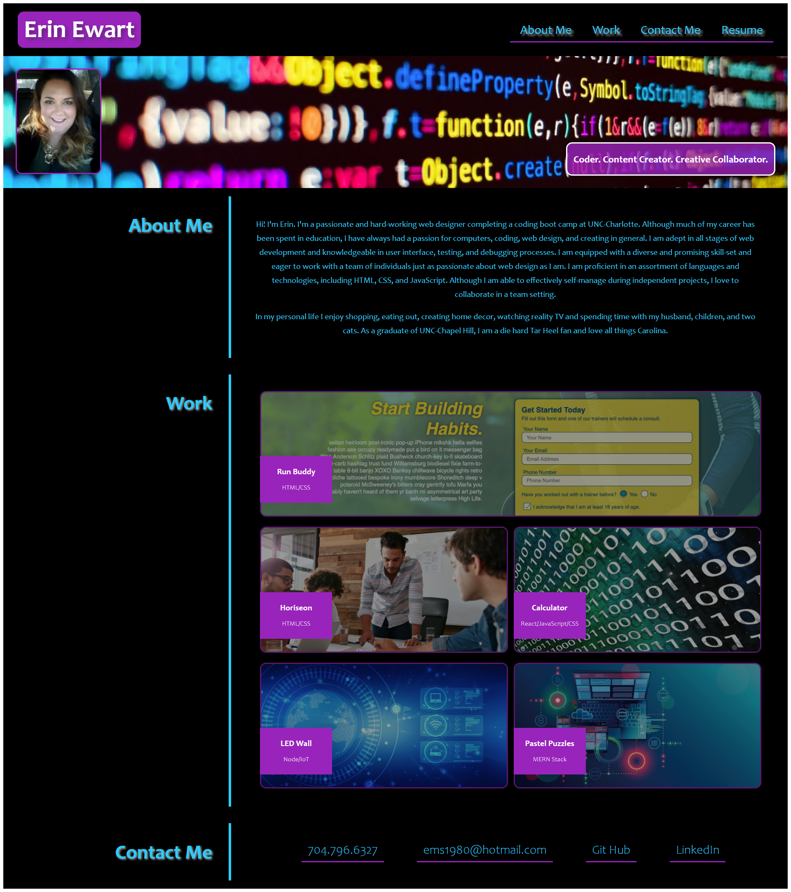

# Erin Ewart Portfolio

## Description

In this project I used HTML and CSS to design a website portfolio to showcase my work to future employers.  It includes a section about me, a section with links to my projects, and a section with my contact info. I created a link to my resume, Git Hub, and LinkedIn website. I used media queries to make my website responsive to various screen sizes and used pseudo cases to style the states of different elements.  I also used the :root pseudo class to declare glabal css values for the colors used so I can easily change the color scheme of my page.

## Languages Used

- HTML
- CSS

## Screenshot
   

## Deployment Link

https://uncgirl02.github.io/erin-ewart-portfolio/

